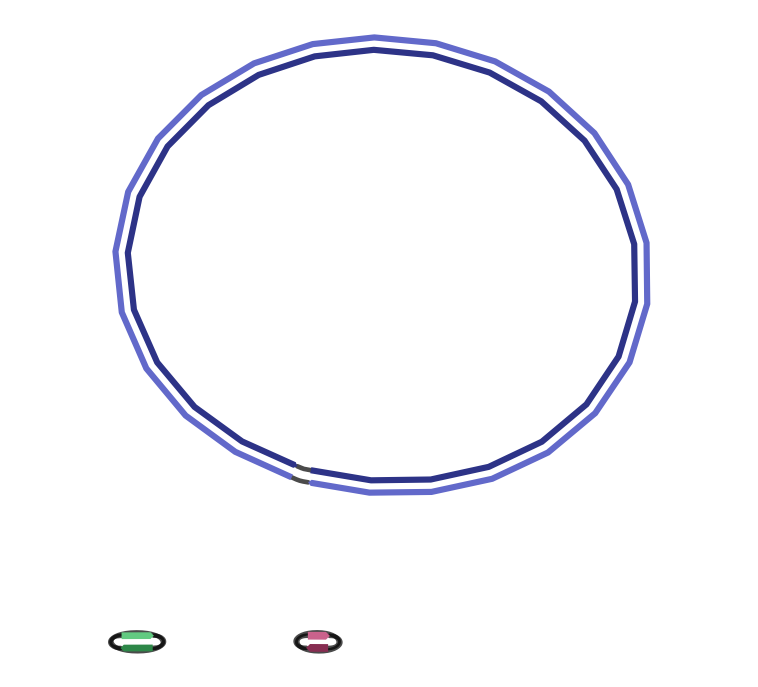

# nanopore
### G2 (SRR5665597, ERR1023775):
- Дейниченко Ксения Александровна
- Иванов Алексей Анатольевич
- Кудрявцева Полина Сергеевна
- Латышев Павел Васильевич

#### Скачайте прочтения
```
$ fastq-dump  --split-files ERR1023775 
$ fastq-dump  --split-files SRR5665597
```
#### Выберите из длинных прочтений самые длинные, суммарной длиной не более 400 миллионов п.н. 
```
$ gzip SRR5665597.fastq
$ filtlong --target_bases 400000000 SRR5665597.fastq.gz | gzip > SRR5665597_f.fastq.gz
```
#### Cоберите геном бактерии из выбранных длинных и всех коротких прочтений, в гибридном режиме. 
```
$ gzip ERR1023775_1.fastq
$ gzip ERR1023775_2.fastq
$ unicycler -1 ERR1023775_1.fastq.gz -2 ERR1023775_2.fastq.gz -l SRR5665597_f.fastq.gz -o genome
```
#### Используя NCBI Blast, определите, к какому виду принадлежит собранная бактерия. 
Klebsiella pneumoniae strain INF059
#### Визуализируйте сборку при помощи программы Bandage.

#### Найдите в вашей сборке гены антибиотикорезистентности и вирулентности. 

##### install abricate
mkdir utils
cd utils
git clone https://github.com/tseemann/abricate.git
export PATH="/mnt/local/vse2020/home/[USERNAME]/utils/abricate/bin:$PATH"
##### install any2fasta (with abricate)
cd abricate/bin
wget https://raw.githubusercontent.com/tseemann/any2fasta/master/any2fasta
chmod +x any2fasta
##### install Path::Tiny (with abricate) {install Perl5 locally [local::bin]}
perl -MCPAN -e shell
install Path::Tiny
cd ../..

##### setup abricate
abricate --check
abricate --setupdb
abricate --list

##### run abricate for every databese
abricate --list | cut -d'       ' -f1 | tail -n+2 > abricate_db_list.txt
cat abricate_db_list.txt | while read db
do
    abricate --db $db --quiet assembly.fasta > "abr_result_$db.txt"
done
